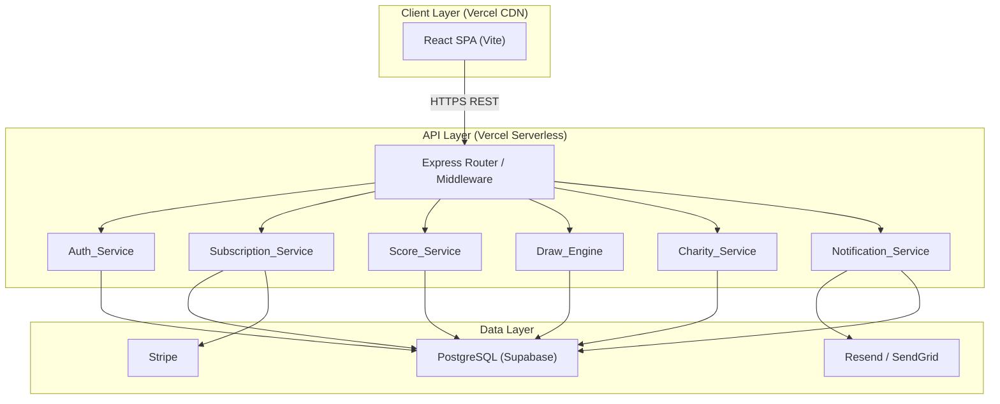
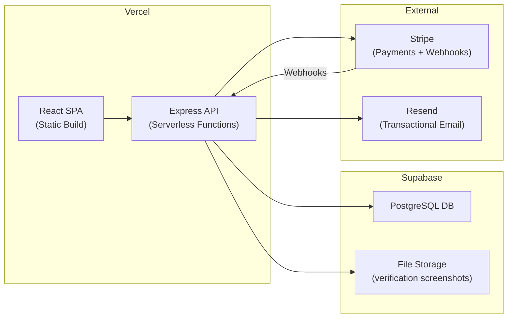

# Design Document — Golf Charity Platform

## Overview

The Golf Charity Platform is a subscription-driven web application that combines Stableford golf score tracking, a monthly prize draw engine, and charity fundraising. Subscribers pay a recurring fee, enter their golf scores, participate in monthly draws, and direct a portion of their subscription to a charity of their choice.

The system is built on the PERN-adjacent stack: React (Vite) frontend deployed to Vercel, Node.js + Express REST API deployed as Vercel Serverless Functions, and PostgreSQL via Supabase as the database. Stripe handles payment processing; JWT handles authentication; Resend (or Nodemailer/SendGrid) handles transactional email.

### Key Design Principles

- **API-first**: All business logic lives in the REST API, enabling future mobile clients (Requirement 18.3)
- **Stateless auth**: JWT tokens — no server-side session state
- **Charity-led UX**: Charitable impact is the emotional hook; the draw is the mechanic
- **Extensible schema**: Currency, locale, and group fields are modelled from day one (Requirements 18.1, 18.2)

---

## Architecture

### High-Level Diagram



### Deployment Architecture



**Environment variables** are stored in Vercel project settings and injected at build/runtime. Supabase connection string, Stripe secret key, JWT secret, and email API key are never committed to source control.

---

## Components and Interfaces

### Auth_Service

Responsibilities: registration, login, JWT issuance, token validation middleware.

```
POST /api/auth/register
POST /api/auth/login
POST /api/auth/refresh
POST /api/auth/logout
GET  /api/auth/me
```

Middleware `authenticateToken(req, res, next)` validates the Bearer JWT on every protected route. A second middleware `requireAdmin(req, res, next)` checks the `role` claim.

### Subscription_Service

Responsibilities: plan management, Stripe Checkout session creation, webhook handling, subscription state transitions.

```
GET    /api/subscriptions/plans
POST   /api/subscriptions/checkout          # creates Stripe Checkout session
POST   /api/subscriptions/webhook           # Stripe webhook receiver (raw body)
GET    /api/subscriptions/status            # current subscriber's status
POST   /api/subscriptions/cancel
PATCH  /api/admin/subscriptions/:id/state   # admin manual override
```

Stripe webhooks drive state transitions: `checkout.session.completed` → active, `invoice.payment_failed` → lapsed, `customer.subscription.deleted` → inactive.

### Score_Service

Responsibilities: score entry CRUD, Score_History rolling-window enforcement (max 5), validation.

```
GET    /api/scores                          # subscriber's score history
POST   /api/scores                          # add score entry
PUT    /api/scores/:id                      # edit score entry
DELETE /api/scores/:id                      # remove score entry
GET    /api/admin/scores/:subscriberId      # admin view
PUT    /api/admin/scores/:id                # admin edit (same validation)
```

### Draw_Engine

Responsibilities: draw number generation (random + weighted), match evaluation, prize pool calculation, jackpot carry-forward.

```
GET    /api/draws                           # list all draws
GET    /api/draws/:id                       # draw detail + results
POST   /api/admin/draws/simulate            # dry-run, no persistence
POST   /api/admin/draws/publish             # finalise and notify
GET    /api/admin/draws/:id/winners         # winners list with payment state
```

### Charity_Service

Responsibilities: charity CRUD, subscriber charity selection, contribution percentage management, independent donations.

```
GET    /api/charities                       # public listing
GET    /api/charities/:id                   # public profile
GET    /api/charities/featured              # spotlight charity
POST   /api/charities/:id/donate            # independent donation
GET    /api/subscriber/charity              # subscriber's selected charity
PUT    /api/subscriber/charity              # change selected charity
PUT    /api/subscriber/charity/contribution # update contribution %
POST   /api/admin/charities                 # create
PUT    /api/admin/charities/:id             # update
DELETE /api/admin/charities/:id             # delete (guarded)
PUT    /api/admin/charities/:id/feature     # set spotlight
```

### Notification_Service

Internal service — not directly exposed via REST. Called by other services after state changes.

```typescript
sendRenewalConfirmation(subscriberId)
sendPaymentFailure(subscriberId)
sendDrawResults(drawId)
sendWinnerNotification(winnerId)
sendVerificationRejection(winnerId, reason)
```

### Winner Verification

```
POST   /api/winners/:id/verify              # subscriber uploads screenshot
GET    /api/admin/winners                   # all winners across draws
PATCH  /api/admin/winners/:id/approve
PATCH  /api/admin/winners/:id/reject
POST   /api/admin/winners/:id/proof         # admin uploads payment proof
```

---

## Data Models

### PostgreSQL Schema

```sql
-- Subscribers (users)
CREATE TABLE subscribers (
    id              UUID PRIMARY KEY DEFAULT gen_random_uuid(),
    email           VARCHAR(255) UNIQUE NOT NULL,
    password_hash   VARCHAR(255) NOT NULL,
    first_name      VARCHAR(100) NOT NULL,
    last_name       VARCHAR(100) NOT NULL,
    role            VARCHAR(20) NOT NULL DEFAULT 'subscriber', -- 'subscriber' | 'admin'
    subscription_state VARCHAR(20) NOT NULL DEFAULT 'inactive', -- active | inactive | lapsed | cancelled
    stripe_customer_id VARCHAR(100),
    stripe_subscription_id VARCHAR(100),
    charity_id      UUID REFERENCES charities(id),
    charity_contribution_pct NUMERIC(5,2) NOT NULL DEFAULT 10.00,
    -- Extensibility (Req 18.1, 18.2)
    currency        VARCHAR(3) NOT NULL DEFAULT 'GBP',
    locale          VARCHAR(10) NOT NULL DEFAULT 'en-GB',
    group_id        UUID,                -- future: corporate/team accounts
    created_at      TIMESTAMPTZ NOT NULL DEFAULT NOW(),
    updated_at      TIMESTAMPTZ NOT NULL DEFAULT NOW()
);

-- Subscription audit log
CREATE TABLE subscription_state_log (
    id              UUID PRIMARY KEY DEFAULT gen_random_uuid(),
    subscriber_id   UUID NOT NULL REFERENCES subscribers(id),
    old_state       VARCHAR(20),
    new_state       VARCHAR(20) NOT NULL,
    changed_by      UUID,               -- NULL = system/Stripe, UUID = admin
    reason          TEXT,
    created_at      TIMESTAMPTZ NOT NULL DEFAULT NOW()
);

-- Subscription plans (static seed data)
CREATE TABLE subscription_plans (
    id              UUID PRIMARY KEY DEFAULT gen_random_uuid(),
    name            VARCHAR(50) NOT NULL,   -- 'monthly' | 'yearly'
    price_pence     INTEGER NOT NULL,       -- stored in smallest currency unit
    interval        VARCHAR(10) NOT NULL,   -- 'month' | 'year'
    stripe_price_id VARCHAR(100) NOT NULL,
    prize_pool_contribution_pct NUMERIC(5,2) NOT NULL DEFAULT 20.00,
    charity_contribution_pct    NUMERIC(5,2) NOT NULL DEFAULT 10.00,
    active          BOOLEAN NOT NULL DEFAULT TRUE
);

-- Charities
CREATE TABLE charities (
    id              UUID PRIMARY KEY DEFAULT gen_random_uuid(),
    name            VARCHAR(255) NOT NULL,
    description     TEXT,
    image_urls      TEXT[],             -- array of Supabase Storage URLs
    is_featured     BOOLEAN NOT NULL DEFAULT FALSE,
    is_active       BOOLEAN NOT NULL DEFAULT TRUE,
    created_at      TIMESTAMPTZ NOT NULL DEFAULT NOW(),
    updated_at      TIMESTAMPTZ NOT NULL DEFAULT NOW()
);

-- Charity events (golf days etc.)
CREATE TABLE charity_events (
    id              UUID PRIMARY KEY DEFAULT gen_random_uuid(),
    charity_id      UUID NOT NULL REFERENCES charities(id) ON DELETE CASCADE,
    title           VARCHAR(255) NOT NULL,
    event_date      DATE NOT NULL,
    description     TEXT,
    created_at      TIMESTAMPTZ NOT NULL DEFAULT NOW()
);

-- Score entries
CREATE TABLE score_entries (
    id              UUID PRIMARY KEY DEFAULT gen_random_uuid(),
    subscriber_id   UUID NOT NULL REFERENCES subscribers(id) ON DELETE CASCADE,
    stableford_score INTEGER NOT NULL CHECK (stableford_score BETWEEN 1 AND 45),
    played_on       DATE NOT NULL,
    created_at      TIMESTAMPTZ NOT NULL DEFAULT NOW(),
    updated_at      TIMESTAMPTZ NOT NULL DEFAULT NOW()
);
-- Only the 5 most recent per subscriber are kept (enforced at application layer)
CREATE INDEX idx_score_entries_subscriber_date ON score_entries(subscriber_id, played_on DESC);

-- Draws
CREATE TABLE draws (
    id              UUID PRIMARY KEY DEFAULT gen_random_uuid(),
    draw_month      DATE NOT NULL,          -- first day of the draw month
    draw_mode       VARCHAR(20) NOT NULL,   -- 'random' | 'algorithmic'
    draw_numbers    INTEGER[] NOT NULL,     -- 5 numbers selected
    prize_pool_total NUMERIC(10,2) NOT NULL DEFAULT 0,
    jackpot_carryforward NUMERIC(10,2) NOT NULL DEFAULT 0,
    tier_5_amount   NUMERIC(10,2) NOT NULL DEFAULT 0,
    tier_4_amount   NUMERIC(10,2) NOT NULL DEFAULT 0,
    tier_3_amount   NUMERIC(10,2) NOT NULL DEFAULT 0,
    active_subscriber_count INTEGER NOT NULL DEFAULT 0,
    status          VARCHAR(20) NOT NULL DEFAULT 'draft', -- 'draft' | 'simulated' | 'published'
    published_at    TIMESTAMPTZ,
    published_by    UUID REFERENCES subscribers(id),
    created_at      TIMESTAMPTZ NOT NULL DEFAULT NOW(),
    UNIQUE (draw_month)                     -- one draw per calendar month
);

-- Draw winners
CREATE TABLE draw_winners (
    id              UUID PRIMARY KEY DEFAULT gen_random_uuid(),
    draw_id         UUID NOT NULL REFERENCES draws(id),
    subscriber_id   UUID NOT NULL REFERENCES subscribers(id),
    match_tier      INTEGER NOT NULL CHECK (match_tier IN (3, 4, 5)),
    matched_numbers INTEGER[] NOT NULL,
    prize_amount    NUMERIC(10,2) NOT NULL DEFAULT 0,
    payment_state   VARCHAR(20) NOT NULL DEFAULT 'pending', -- 'pending' | 'verified' | 'paid' | 'rejected'
    verification_screenshot_url TEXT,
    verification_submitted_at   TIMESTAMPTZ,
    reviewed_by     UUID REFERENCES subscribers(id),
    reviewed_at     TIMESTAMPTZ,
    rejection_reason TEXT,
    payment_proof_url TEXT,
    created_at      TIMESTAMPTZ NOT NULL DEFAULT NOW()
);

-- Charity contributions (ledger)
CREATE TABLE charity_contributions (
    id              UUID PRIMARY KEY DEFAULT gen_random_uuid(),
    subscriber_id   UUID NOT NULL REFERENCES subscribers(id),
    charity_id      UUID NOT NULL REFERENCES charities(id),
    amount_pence    INTEGER NOT NULL,
    contribution_type VARCHAR(20) NOT NULL, -- 'subscription' | 'donation'
    stripe_payment_intent_id VARCHAR(100),
    created_at      TIMESTAMPTZ NOT NULL DEFAULT NOW()
);

-- Notification log
CREATE TABLE notification_log (
    id              UUID PRIMARY KEY DEFAULT gen_random_uuid(),
    subscriber_id   UUID REFERENCES subscribers(id),
    notification_type VARCHAR(50) NOT NULL,
    status          VARCHAR(20) NOT NULL,   -- 'sent' | 'failed'
    provider_message_id VARCHAR(255),
    created_at      TIMESTAMPTZ NOT NULL DEFAULT NOW()
);
```

---

## Draw Engine Algorithm Design

### Random Mode

Generates 5 statistically independent, uniformly distributed integers in the range [1, 45] without replacement using the Fisher-Yates shuffle on the full range.

```
function generateRandomNumbers(count = 5, min = 1, max = 45):
    pool = [min..max]                    // [1, 2, ..., 45]
    shuffle pool using crypto.randomInt  // cryptographically secure
    return pool.slice(0, count)          // first 5
```

`crypto.randomInt` (Node.js built-in) is used rather than `Math.random()` to ensure cryptographic quality randomness.

### Algorithmic (Weighted) Mode

Builds a frequency distribution from all active subscribers' current score histories, then uses weighted random sampling without replacement.

```
function generateWeightedNumbers(count = 5, min = 1, max = 45):
    // 1. Build frequency map from all active subscriber score histories
    freq = {}
    for each active subscriber:
        for each score in subscriber.scoreHistory:
            freq[score] = (freq[score] ?? 0) + 1

    // 2. Build weight array for range [1..45]
    //    Scores with no occurrences get weight = 1 (floor) to remain selectable
    weights = []
    for n in [1..45]:
        weights[n] = max(freq[n] ?? 0, 1)

    // 3. Weighted sampling without replacement (5 draws)
    selected = []
    remaining = copy of weights
    repeat count times:
        total = sum(remaining)
        r = crypto.randomInt(0, total)
        pick number n where cumulative weight crosses r
        selected.push(n)
        remaining[n] = 0                 // remove from pool
    return selected
```

The weighting means numbers that appear frequently in subscriber scores are more likely to be drawn, increasing the chance of winners and making the draw feel responsive to the player community.

### Match Evaluation

```
function evaluateMatches(drawNumbers, subscribers):
    winners = []
    for each subscriber with active subscription:
        scores = subscriber.scoreHistory.map(e => e.stablefordScore)
        matched = intersection(scores, drawNumbers)
        if matched.length >= 3:
            winners.push({
                subscriberId: subscriber.id,
                matchTier: matched.length,   // 3, 4, or 5
                matchedNumbers: matched
            })
    return winners
```

### Prize Pool Calculation

```
function calculatePrizePool(activeSubscriberCount, planBreakdown, jackpotCarryforward):
    // Sum prize_pool_contribution from each active subscriber's plan
    basePool = sum(subscriber.plan.pricePerMonth * subscriber.plan.prizePoolContributionPct / 100)

    totalPool = basePool + jackpotCarryforward

    tier5 = totalPool * 0.40
    tier4 = totalPool * 0.35
    tier3 = totalPool * 0.25

    return { totalPool, tier5, tier4, tier3 }

function distributeWinnings(winners, tierAmounts):
    for tier in [5, 4, 3]:
        tierWinners = winners.filter(w => w.matchTier === tier)
        if tierWinners.length > 0:
            share = tierAmounts[tier] / tierWinners.length
            tierWinners.forEach(w => w.prizeAmount = share)

    // Jackpot carry-forward
    if no winner with matchTier === 5:
        nextDrawJackpotCarryforward = tierAmounts[5]
    else:
        nextDrawJackpotCarryforward = 0

    return { winners, nextDrawJackpotCarryforward }
```

---

## Frontend Architecture

### Technology Choices

- **Vite + React 18** — fast HMR, optimised production builds
- **React Router v6** — client-side routing
- **Zustand** — lightweight global state (auth, subscription status)
- **React Query (TanStack Query)** — server state, caching, background refetch
- **Tailwind CSS** — utility-first, mobile-first responsive design
- **Stripe.js / React Stripe.js** — PCI-compliant payment UI

### Route Structure

```
/                           Public homepage (featured charity, CTA)
/charities                  Public charity listing
/charities/:id              Public charity profile
/how-it-works               Draw mechanics explanation
/register                   Registration + charity selection + payment
/login                      Login
/dashboard                  Subscriber dashboard (protected)
  /dashboard/scores         Score entry & history
  /dashboard/draws          Draw history & results
  /dashboard/charity        Charity selection & contribution
  /dashboard/account        Account & subscription management
/admin                      Admin dashboard (admin role required)
  /admin/users              User management
  /admin/draws              Draw management
  /admin/charities          Charity management
  /admin/winners            Winner verification & payouts
  /admin/reports            Analytics & reports
```

### Component Structure

```
src/
├── components/
│   ├── ui/                 # Reusable primitives (Button, Input, Modal, Badge)
│   ├── layout/             # Header, Footer, Sidebar, PageWrapper
│   ├── auth/               # LoginForm, RegisterForm, ProtectedRoute
│   ├── scores/             # ScoreEntryForm, ScoreHistoryList, ScoreCard
│   ├── draws/              # DrawCard, DrawResults, DrawNumberBall
│   ├── charities/          # CharityCard, CharitySearch, CharityProfile
│   ├── subscription/       # PlanSelector, SubscriptionStatus, BillingCard
│   └── admin/              # UserTable, DrawControls, WinnerTable, ReportsPanel
├── pages/
│   ├── public/             # Home, Charities, CharityProfile, HowItWorks
│   ├── auth/               # Login, Register
│   ├── dashboard/          # Dashboard, Scores, Draws, Charity, Account
│   └── admin/              # AdminLayout + all admin pages
├── hooks/
│   ├── useAuth.ts
│   ├── useSubscription.ts
│   ├── useScores.ts
│   └── useDraws.ts
├── store/
│   └── authStore.ts        # Zustand: user, token, role
├── api/
│   └── client.ts           # Axios instance with JWT interceptor
└── utils/
    ├── validation.ts
    └── formatters.ts
```

### State Management Strategy

- **Zustand `authStore`**: JWT token, user profile, role — persisted to `localStorage`
- **React Query**: All server data (scores, draws, charities, subscription status) — handles caching, loading states, and background sync
- **Local component state**: Form inputs, modal open/close, UI toggles

### Registration Flow (Multi-Step)

```
Step 1: Personal details (name, email, password)
Step 2: Plan selection (monthly / yearly)
Step 3: Charity selection (search + select)
Step 4: Payment (Stripe Checkout redirect or embedded)
→ On success: account activated, redirect to /dashboard
```

---

## Security Design

### Authentication

- Passwords hashed with **bcrypt** (cost factor 12) — one-way, per-user salt (Requirement 17.4)
- JWT access tokens: 15-minute expiry, signed with `HS256` using a 256-bit secret
- JWT refresh tokens: 7-day expiry, stored in `HttpOnly` cookie (not accessible to JS)
- Token payload: `{ sub: userId, role, iat, exp }`
- On every protected request: middleware verifies signature, expiry, and subscription state

### Input Sanitisation

- All user input sanitised with **`validator.js`** and **`express-validator`** before DB writes (Requirement 17.5)
- Parameterised queries via **`pg`** (node-postgres) — no raw string interpolation
- File uploads (verification screenshots) validated for MIME type and size before Supabase Storage write

### HTTPS

- Vercel enforces HTTPS on all deployments automatically (Requirement 17.2, 1.5)
- HSTS header set via Vercel `vercel.json` headers config
- Stripe webhook signature verified with `stripe.webhooks.constructEvent` to prevent spoofing

### Additional Hardening

- **Helmet.js** — sets secure HTTP headers (CSP, X-Frame-Options, etc.)
- **express-rate-limit** — rate limiting on auth endpoints (max 10 req/15 min per IP)
- **CORS** — restricted to the Vercel frontend origin
- Admin routes double-gated: JWT middleware + role check middleware

---

## Error Handling

### API Error Response Format

All errors return a consistent JSON envelope:

```json
{
  "error": {
    "code": "VALIDATION_ERROR",
    "message": "Stableford score must be between 1 and 45",
    "fields": { "stableford_score": "Must be between 1 and 45" }
  }
}
```

### Error Codes

| Code | HTTP Status | Description |
|------|-------------|-------------|
| `VALIDATION_ERROR` | 400 | Input failed validation |
| `AUTH_INVALID_CREDENTIALS` | 401 | Login failed (generic — no field hint) |
| `AUTH_TOKEN_EXPIRED` | 401 | JWT expired |
| `AUTH_FORBIDDEN` | 403 | Insufficient role |
| `SUBSCRIPTION_INACTIVE` | 403 | Subscription not active |
| `NOT_FOUND` | 404 | Resource not found |
| `DRAW_ALREADY_PUBLISHED` | 409 | Duplicate draw for month |
| `CHARITY_HAS_SUBSCRIBERS` | 409 | Cannot delete charity with active subscribers |
| `PAYMENT_FAILED` | 402 | Stripe payment failure |
| `INTERNAL_ERROR` | 500 | Unexpected server error |

### Frontend Error Handling

- React Query `onError` callbacks surface API errors to toast notifications
- Form validation errors mapped to field-level messages via `react-hook-form`
- Global error boundary catches unexpected React render errors

---

## Testing Strategy

### Unit Tests (Jest + Supertest)

Focus on specific examples, edge cases, and error conditions:

- Auth_Service: registration validation, login error messages, token expiry
- Score_Service: boundary values (score = 1, score = 45, score = 0, score = 46), rolling window (6th entry removes oldest)
- Draw_Engine: prize pool arithmetic, tier allocation percentages, jackpot carry-forward logic
- Charity_Service: deletion guard (active subscribers), contribution percentage bounds

### Property-Based Tests (fast-check)

See Correctness Properties section below. Each property test runs a minimum of 100 iterations.

Tag format: `// Feature: golf-charity-platform, Property N: <property_text>`

### Integration Tests

- Stripe webhook handling (mock Stripe events)
- Supabase query correctness (test database)
- Email notification dispatch (mock email provider)

### Frontend Tests (Vitest + React Testing Library)

- Component rendering with mock data
- Form submission flows
- Protected route redirection

### End-to-End Tests (Playwright)

- Full registration → subscription → score entry → draw participation flow
- Admin draw publish flow
- Winner verification flow


---

## Correctness Properties

*A property is a characteristic or behavior that should hold true across all valid executions of a system — essentially, a formal statement about what the system should do. Properties serve as the bridge between human-readable specifications and machine-verifiable correctness guarantees.*

Property-based testing is applied here using **fast-check** (TypeScript/JavaScript PBT library). Each property test runs a minimum of 100 iterations. Tests are tagged with: `// Feature: golf-charity-platform, Property N: <property_text>`

---

### Property 1: Validation errors cover all invalid fields

*For any* registration payload where one or more fields are invalid, the Auth_Service response SHALL contain an error entry for every invalid field — no invalid field is silently ignored.

**Validates: Requirements 1.2**

---

### Property 2: Generic authentication error message

*For any* combination of email and password that does not match a registered subscriber, the Auth_Service SHALL return the same generic error message regardless of which field (email, password, or both) is incorrect.

**Validates: Requirements 1.4**

---

### Property 3: All protected routes require a valid JWT

*For any* protected API endpoint, a request made without a valid JWT token SHALL receive a 401 response — no protected resource is accessible without authentication.

**Validates: Requirements 1.7**

---

### Property 4: Non-active subscribers are denied access to platform features

*For any* protected API endpoint and *for any* subscriber whose subscription_state is not 'active', the request SHALL receive a 403 response — platform features are inaccessible to inactive, lapsed, or cancelled subscribers.

**Validates: Requirements 2.5**

---

### Property 5: Subscription state is always a valid enum value

*For any* subscriber record at any point in time, the subscription_state field SHALL be one of exactly four values: 'active', 'inactive', 'lapsed', or 'cancelled' — no other state is ever persisted.

**Validates: Requirements 2.9**

---

### Property 6: Stableford score validation accepts [1,45] and rejects all others

*For any* integer n, submitting n as a Stableford score SHALL be accepted if and only if 1 ≤ n ≤ 45 — scores outside this range are always rejected with a descriptive validation error.

**Validates: Requirements 3.1, 3.3**

---

### Property 7: Score history rolling window invariant

*For any* subscriber and *for any* sequence of valid score entries submitted in order, the Score_Service SHALL maintain a score history of at most 5 entries at all times — when a 6th entry is added, the oldest entry is removed and the new entry is present, and when fewer than 5 entries exist, adding one increases the count by exactly 1.

**Validates: Requirements 3.4, 3.5, 3.8**

---

### Property 8: Score history is always sorted newest-first

*For any* subscriber's score history containing entries with varying dates, the Score_Service SHALL return entries in reverse chronological order — the entry with the most recent played_on date always appears first.

**Validates: Requirements 3.6**

---

### Property 9: Draw number output invariants (both modes)

*For any* invocation of the Draw_Engine in either random or algorithmic mode, the generated draw numbers SHALL always be exactly 5 distinct integers, each in the range [1, 45] inclusive — no duplicates, no out-of-range values, always exactly 5.

**Validates: Requirements 4.2, 4.3**

---

### Property 10: Match evaluation correctness

*For any* set of draw numbers and *for any* subscriber score history, the Draw_Engine SHALL identify the subscriber as a winner if and only if the intersection of their scores and the draw numbers contains 3 or more elements — no false positives, no false negatives.

**Validates: Requirements 4.5**

---

### Property 11: Match tier equals intersection size

*For any* winner record, the match_tier field SHALL equal the exact count of numbers that appear in both the subscriber's score history and the draw numbers — a 3-match is tier 3, a 4-match is tier 4, a 5-match is tier 5.

**Validates: Requirements 4.6**

---

### Property 12: Prize pool tier allocation percentages

*For any* prize pool total amount, the Draw_Engine SHALL allocate exactly 40% to tier 5, exactly 35% to tier 4, and exactly 25% to tier 3 — the three allocations always sum to 100% of the total pool.

**Validates: Requirements 5.2, 5.3, 5.4**

---

### Property 13: Equal prize sharing within a tier

*For any* draw tier with N winners (N ≥ 1), each winner's prize_amount SHALL equal the tier's total allocation divided by N — no winner in the same tier receives more or less than any other.

**Validates: Requirements 5.5**

---

### Property 14: Jackpot carry-forward accumulates correctly

*For any* sequence of draws where no tier-5 winner exists, the tier-5 allocation of the next draw SHALL include the full jackpot amount from the previous draw — the carry-forward is never lost or reduced.

**Validates: Requirements 5.6**

---

### Property 15: Charity contribution is always at least 10%

*For any* subscriber with any active subscription plan, the charity_contribution amount recorded for each subscription payment SHALL be greater than or equal to 10% of the subscription fee — the minimum contribution floor is never violated.

**Validates: Requirements 6.2**

---

### Property 16: Charity search returns all and only matching results

*For any* search query string and *for any* set of charity records, the Charity_Service SHALL return all charities whose name or description contains the query (case-insensitive) and SHALL NOT return any charity that does not match — no false positives, no false negatives.

**Validates: Requirements 7.2**

---

### Property 17: Charity profile response contains all required fields

*For any* charity record in the system, a GET request to its profile endpoint SHALL return a response containing name, description, image_urls, and events — no required field is ever absent from the response.

**Validates: Requirements 7.4**

---

### Property 18: Payment processing restricted to verified winners

*For any* winner record, prize payment processing SHALL only proceed if payment_state is 'paid' — winners with any other payment_state ('pending', 'rejected') are always blocked from payment processing.

**Validates: Requirements 8.5**

---

### Property 19: Charity deletion blocked when active subscribers exist

*For any* charity that has one or more active subscribers assigned to it, a DELETE request SHALL be rejected with a CHARITY_HAS_SUBSCRIBERS error that includes the count of affected subscribers — no charity with active subscribers can ever be deleted.

**Validates: Requirements 12.3, 12.4**

---

### Property 20: Password hashing is one-way with per-user salt

*For any* plaintext password, the stored hash SHALL never equal the plaintext, and bcrypt.compare(plaintext, hash) SHALL return true — passwords are always stored as bcrypt hashes and are never recoverable from the stored value.

**Validates: Requirements 17.4**

---

### Property 21: User input sanitisation prevents injection payloads

*For any* user-supplied input string containing SQL injection or XSS characters, the value persisted to the database SHALL be the sanitised/escaped form — raw injection payloads are never stored or reflected back unescaped.

**Validates: Requirements 17.5**

---

## Scalability Considerations

### Database

- All foreign keys indexed; composite indexes on hot query paths (e.g., `score_entries(subscriber_id, played_on DESC)`)
- Supabase connection pooling via PgBouncer (built-in) handles concurrent serverless function connections
- `currency` and `locale` columns on `subscribers` and `subscription_plans` support multi-currency expansion (Requirement 18.1)
- `group_id` on `subscribers` supports future corporate/team accounts (Requirement 18.2)

### API

- Stateless Express handlers deploy as Vercel Serverless Functions — scale to zero, auto-scale on demand
- React Query caching on the frontend reduces redundant API calls
- Pagination on all list endpoints (`/api/charities`, `/api/admin/users`, etc.) via `limit` + `cursor` query params

### Draw Engine

- Draw evaluation is a single-pass O(S × 5) operation (S = active subscribers, 5 = max scores per subscriber) — efficient even at thousands of subscribers
- Simulation runs in-memory without DB writes, so it can be called repeatedly without side effects

### Future Mobile Support

- All business logic is in the REST API — a React Native or Flutter app can consume the same endpoints (Requirement 18.3)
- JWT auth is transport-agnostic
- API versioning via `/api/v1/` prefix is recommended before mobile launch
